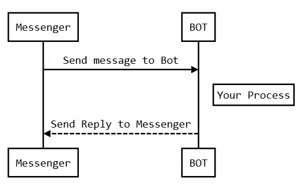

# BOT Template

## What is it?

Code ini merupakan template sederhana yang bisa digunakan untuk membuat [Bot](http://www.carik.id "Bot"). Saat ini disediakan contoh untuk platform:
- Facebook Messenger
- Telegram.

Contoh yang disediakan hanya melakukan reply echo dari pesan yang dikirim oleh user.

Code disini merupakan basic code yang digunakan oleh [Carik Bot](http://www.carik.id "Carik Bot"), ***[BOT Like Humans](http://www.carik.id "BOT Like Humans")*** yang dibangun dengan menggunakan bahasa Pascal.

## Why use it?

**Ringan Tanpa Beban**

BOT ini dibuat dengan sederhana, simple dan ringan. BOT ini merupakan  _binary application_ sehingga diharapkan akan lebih cepat dan ringan. 

Kompatibel dengan shared hosting umumnya.

Untuk penggunaan custom, cukup dibutuhkan instalasi Apache Web Server regular.


## How to use it


### Requirements

- [x] [FastPlaz_runtime](http://www.fastplaz.com/)


### Development

Gunakan Lazarus, buka file "telegram.lpi" dan *compile* file tersebut.

Akan terbentuk file binary di 'public_html/ai/telegram.bin'

#### Telegram

Buka file project dari Lazarus (atau code editor lainnya), akan dijumpai baris-baris code seperti berikut.


```delphi
procedure TMainModule.Post;
var
  messageText, replyText: string;
begin
  TELEGRAM.RequestContent := Request.Content;
  TELEGRAM.Token := Config['telegram/token'];
  MessageID := TELEGRAM.MessageID;
  messageText := Telegram.Text;

  //-- your code here

  replyText := 'ECHO: ' + messageText;


  //-- send response
  TELEGRAM.SendMessage(TELEGRAM.ChatID, replyText);
  Response.Content := 'OK';
  if Config['systems/debug'] then
    Response.Content := TELEGRAM.ResultText;
end;    
```

Template ini hanya melakukan *reply echo* dari message yang dikirim oleh user. Silakan dikembangkan sesuai keperluan.

### Instalasi

**Compile dari Command-Line**

```
SimpleBOT$ cd source/
source$ ./clean.sh 
source$ ./build.sh
.
.
telegram.lpr(13,124)
Assembling (pipe) lib/telegram.s
Compiling resource lib/telegram.or
Linking ../public_html/ai/telegram.bin
.
.
source$ _

```

**Custom Build**

untuk konfigurasi custom, misal untuk perubahan path tempat library berada, bisa dilakukan dengan melakukan modifikasi di file **extra.cfg**.


### Konfigurasi

Buka file "public_html/config/config.json",
akan dijumpai seperti ini


```javascript
{
  .
  .
  "telegram": {
  "token": "your_telegram_token"
  },
  "facebook": {
  "token": "your_facebook_token"
  }
}

```
tuliskan token bot telegram atau facebook anda di dalam file config.json tersebut.

### NLP

Agar lebih menarik, anda bisa melengkapi Bot anda dengan [NLP](https://github.com/luridarmawan/SimpleAI/tree/development "NLP") *(Natural Language Processing)*. Banyak tersedia vendor NLP yang bisa digunakan. Tetapi jika anda mencari NLP simple, ringan dan cepat, anda bisa menggunakan NLP dari [SimpleAI](https://github.com/luridarmawan/SimpleAI/tree/development "SimpleAI").

      
### BOT Sequence Diagram

Berikut ini sequence diagram sederhana dari bagaimana Bot bekerja, mulai dari user mengirim pesan dan menerima jawaban dari Bot.
                    
```seq
User->Messenger: Send message
Messenger->BOT: Send message to Bot 
Note right of BOT: Your Process 
BOT-->Messenger: Send Reply to Messenger 
Messenger-->User:Send Reply to User
```


